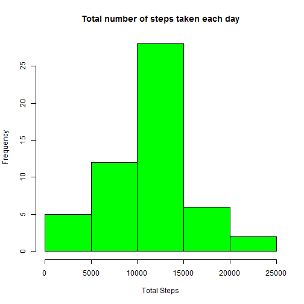
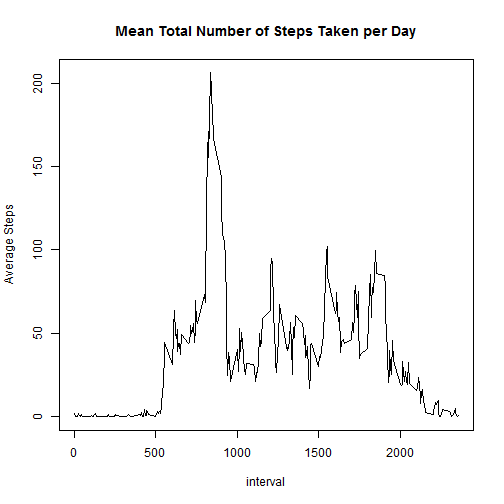
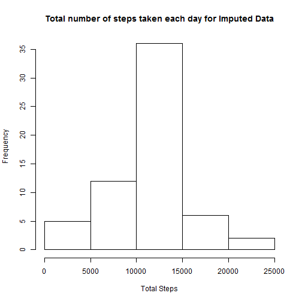

# Reproducible Research: Peer Assessment 1
* * *

## Loading and preprocessing the data

```r
if (!file.exists("activity.csv")) {
  if (!file.exists("activity.zip")) {
    stop("Please make sure the file 'activity.csv' or 'activity.zip' file is in the working directory")
  } else {
    unzip("activity.zip")
  }
}

activity <- read.csv("activity.csv", colClasses=c(NA,"Date",NA))
```
Checking the loaded data

```r
head(activity)
```

```
##   steps       date interval
## 1    NA 2012-10-01        0
## 2    NA 2012-10-01        5
## 3    NA 2012-10-01       10
## 4    NA 2012-10-01       15
## 5    NA 2012-10-01       20
## 6    NA 2012-10-01       25
```

Checking the dimension of the data

```r
dim(activity)
```

```
## [1] 17568     3
```

Check the structure of the data

```r
str(activity)
```

```
## 'data.frame':	17568 obs. of  3 variables:
##  $ steps   : int  NA NA NA NA NA NA NA NA NA NA ...
##  $ date    : Date, format: "2012-10-01" "2012-10-01" ...
##  $ interval: int  0 5 10 15 20 25 30 35 40 45 ...
```
Checking the summary of the data

```r
summary(activity)
```

```
##      steps            date               interval   
##  Min.   :  0.0   Min.   :2012-10-01   Min.   :   0  
##  1st Qu.:  0.0   1st Qu.:2012-10-16   1st Qu.: 589  
##  Median :  0.0   Median :2012-10-31   Median :1178  
##  Mean   : 37.4   Mean   :2012-10-31   Mean   :1178  
##  3rd Qu.: 12.0   3rd Qu.:2012-11-15   3rd Qu.:1766  
##  Max.   :806.0   Max.   :2012-11-30   Max.   :2355  
##  NA's   :2304
```
There are 17568 records and 3 variables. The data contain 2304 missing values.

## What is mean total number of steps taken per day?
Preparing the data to answer the question

Ignoring the missing values(Removing missing velues)


```r
activity_nona <- activity[complete.cases(activity),]
head(activity_nona)
```

```
##     steps       date interval
## 289     0 2012-10-02        0
## 290     0 2012-10-02        5
## 291     0 2012-10-02       10
## 292     0 2012-10-02       15
## 293     0 2012-10-02       20
## 294     0 2012-10-02       25
```

There are 15264 complete cases

Using the package plyr to format and summarize.


```r
##Checking if the package plyr exist and if not to install it
if(require("plyr")){
  print("plyr is loaded correctly")
} else {
  print("trying to install plyr")
  install.packages("plyr")
  if(require(plyr)){
    print("plyr installed and loaded")
  } else {
    stop("could not install plyr")
  }
}
```

```
## Loading required package: plyr
```

```
## [1] "plyr is loaded correctly"
```

Transforming the data


```r
total_steps_day_nona <- ddply(activity_nona, .(date), summarise,
                      total_s = sum(steps))
```
#### 1. Histogram of the total number of steps taken each day

```r
hist(total_steps_day_nona$total_s, 
     main = "Total number of steps taken each day",
     xlab = "Total Steps", col="green")
```

 

#### 2. To Calculate and report the mean and median total number of steps taken per day


```r
summary(total_steps_day_nona)
```

```
##       date               total_s     
##  Min.   :2012-10-02   Min.   :   41  
##  1st Qu.:2012-10-16   1st Qu.: 8841  
##  Median :2012-10-29   Median :10765  
##  Mean   :2012-10-30   Mean   :10766  
##  3rd Qu.:2012-11-16   3rd Qu.:13294  
##  Max.   :2012-11-29   Max.   :21194
```

The Mean   :10766   and Median :10765  

## What is the average daily activity pattern?

#### 1. Make a time series plot (i.e. type = "l") of the 5-minute interval (x-axis) and the average number of steps taken, averaged across all days (y-axis)


```r
average_steps_day_nona <- ddply(activity_nona, .(interval), 
                           summarise,
                         average_s = mean(steps))
head(average_steps_day_nona)
```

```
##   interval average_s
## 1        0   1.71698
## 2        5   0.33962
## 3       10   0.13208
## 4       15   0.15094
## 5       20   0.07547
## 6       25   2.09434
```


```r
with(data=average_steps_day_nona, 
      plot(interval, average_s, type="l",
      main = "Mean Total Number of Steps Taken per Day",
      ylab = "Average Steps"))
```

 

#### 2. Which 5-minute interval, on average across all the days in the dataset, contains the maximum number of steps?


```r
##Finding the maximum value
mx <- max(average_steps_day_nona$average_s)

##Locating the 5-minute interval which contains the maximum number of steps
interval <- average_steps_day_nona[average_steps_day_nona$average_s==mx,1]
interval
```

```
## [1] 835
```

The 5-minute interval which contains the maximum number of steps is 835

## Imputing missing values

#### 1. Calculate and report the total number of missing values in the dataset (i.e. the total number of rows with NAs)

```r
##The total number of missing values in the dataset
sum(!complete.cases(activity))
```

```
## [1] 2304
```

#### 2. Devise a strategy for filling in all of the missing values in the dataset. The strategy does not need to be sophisticated. For example, you could use the mean/median for that day, or the mean for that 5-minute interval, etc.
Using the mean for the particular 5-minute interval to fill the particular missing value

#### 3. Create a new dataset that is equal to the original dataset but with the missing data filled in.
Using impute() from package Hmisc and ddply from package plyr


```r
##Loading the Hmisc package and if is not going to be found it will be get installed
if(require("Hmisc")){
  print("Hmisc is loaded correctly")
} else {
  print("trying to install Hmisc")
  install.packages("Hmisc")
  if(require(Hmisc)){
    print("Hmisc installed and loaded")
  } else {
    stop("could not install Hmisc")
  }
}
```

```
## Loading required package: Hmisc
## Loading required package: grid
## Loading required package: lattice
## Loading required package: survival
## Loading required package: splines
## Loading required package: Formula
## 
## Attaching package: 'Hmisc'
## 
## The following objects are masked from 'package:plyr':
## 
##     is.discrete, summarize
## 
## The following objects are masked from 'package:base':
## 
##     format.pval, round.POSIXt, trunc.POSIXt, units
```

```
## [1] "Hmisc is loaded correctly"
```

Imputing

```r
activity_imp <- ddply(activity, "interval", mutate, imputed.steps = impute(steps, mean))
#Selecting the columns of interest and ordering them using order function
activity_imp <- activity_imp[order(activity_imp$date),c(4,2,3)]
dim(activity_imp)
```

```
## [1] 17568     3
```

```r
head(activity_imp)
```

```
##     imputed.steps       date interval
## 1         1.71698 2012-10-01        0
## 62        0.33962 2012-10-01        5
## 123       0.13208 2012-10-01       10
## 184       0.15094 2012-10-01       15
## 245       0.07547 2012-10-01       20
## 306       2.09434 2012-10-01       25
```

#### 4. Make a histogram of the total number of steps taken each day and Calculate and report the mean and median total number of steps taken per day. Do these values differ from the estimates from the first part of the assignment? What is the impact of imputing missing data on the estimates of the total daily number of steps?

Preparing the data


```r
imp_total_steps_day <- ddply(activity_imp, .(date), summarise,
                         imp_total_s = sum(imputed.steps))
head(imp_total_steps_day)
```

```
##         date imp_total_s
## 1 2012-10-01       10766
## 2 2012-10-02         126
## 3 2012-10-03       11352
## 4 2012-10-04       12116
## 5 2012-10-05       13294
## 6 2012-10-06       15420
```

```r
summary(imp_total_steps_day$imp_total_s)
```

```
##    Min. 1st Qu.  Median    Mean 3rd Qu.    Max. 
##      41    9820   10800   10800   12800   21200
```
Ploting the histogram

```r
##Histogram of the total number of steps taken each day
hist(imp_total_steps_day$imp_total_s,
     main = "Total number of steps taken each day for Imputed Data",
     xlab = "Total Steps")
```

 

## Are there differences in activity patterns between weekdays and weekends?
